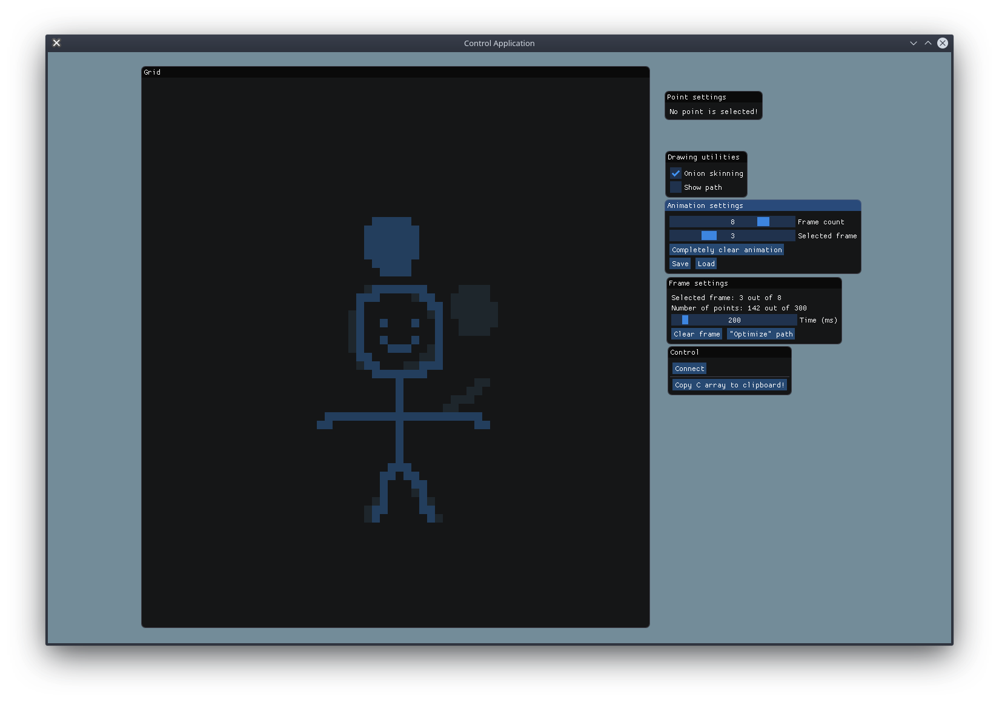
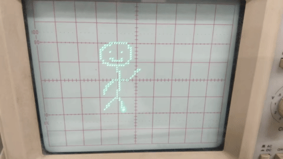

# Oscilloscope drawing using a PIC32 and a DAC
This project consists on the use of a DAC (Digital-to-Analog Converter) driven by a PIC32 in order to
draw point-based pictures on an oscilloscope (using XY mode).

There are several ways to generate these pictures, and they may even be created in real-time as a result
of an interactive application.

We developed a desktop application that provides drawing utilities for creating still or animated
pictures. This application uses a serial communication protocol for sending the pictures to the PIC32.

We also developed a simple Pong game to test the real-time capabilities of our communication protocol.

## Showcase
### Drawing utility and animations made with it
Here we can see the [onion skinning](https://en.wikipedia.org/wiki/Onion_skinning) feature in effect
(previous frame is visible as a "ghost")

Animations:

### Pong game
[Watch on YouTube](https://www.youtube.com/watch?v=mHO34W-vX0c)
[

](https://www.youtube.com/watch?v=mHO34W-vX0c)
